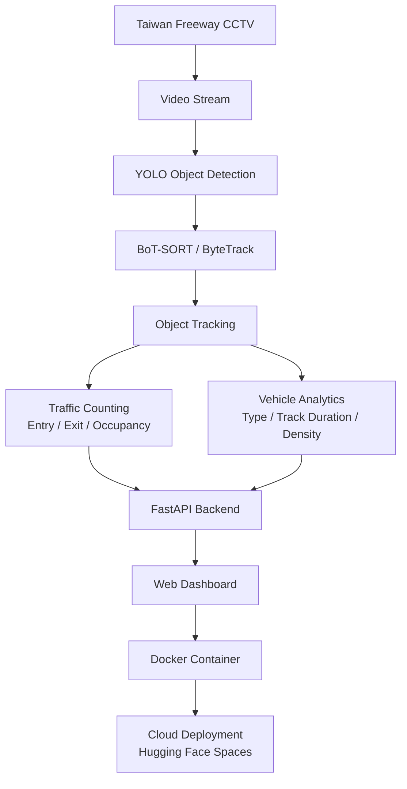

# Taiwan Freeway Traffic Analytics

Real-time vehicle detection, tracking, counting, and speed estimation
on Taiwan Freeway CCTV footage, built with YOLO + BoT-SORT/ByteTrack,
served through a FastAPI backend and a live web dashboard.

**[Live demo](https://huggingface.co/spaces/JH-portfolio/traffic_analytics)** · **[Source code](https://huggingface.co/spaces/JH-portfolio/traffic_analytics/tree/main)**

## Project overview

This project turns a Taiwan Freeway CCTV feed into structured traffic
data in real time: how many vehicles passed, per-lane counts and
direction split, vehicle type breakdown, and per-vehicle speed —
all visible on a live web dashboard, not just logged to a file.
It's built to run against either the bundled test video or the
actual live government CCTV stream, switchable with one environment
variable, and is fully containerized for cloud deployment.

## Architecture



A few implementation details that don't show up in the diagram but
mattered in practice:

- **Line-crossing counting uses hysteresis, not a single-frame
  check.** Comparing only the last two trajectory points against a
  narrow dead-zone undercounts vehicles that cross gradually across
  several frames — this tracks which side of the counting line each
  vehicle was last confirmed on, and only counts a crossing once it's
  clearly on the other side, regardless of how many frames it took.
- **The live CCTV source auto-reconnects with exponential backoff**
  on a dropped connection, since MJPEG-over-HTTP government feeds
  hiccup regularly. The bundled test video deliberately does *not*
  retry on a failed read — that's normal end-of-video, not a
  connection drop, and retrying would loop forever on a finished
  file.
- **Lane ranges and the counting line are resolution-dependent and
  swap based on the video source** (`config.py`): the bundled test
  video and the live CCTV feed have very different resolutions and
  camera angles, so both `LANE_RANGES`/`LINE_Y` are calibrated
  separately per source (see `calibrate_lanes.py` /
  `calibrate_lanes_for_live_highway_traffic.py`) and selected
  automatically via the `USE_LIVE_SOURCE` environment variable.

## Run locally

```
pip install -r requirements.txt
pip install torch --index-url https://download.pytorch.org/whl/cpu
uvicorn app:app --reload
```

Open http://localhost:8000.

## Run with Docker

```
docker compose up --build
```

See `DEPLOY.md` for cloud deployment notes, and
`calibrate_lanes.py` / `calibrate_lanes_for_live_highway_traffic.py`
if you're pointing this at a different video or camera and need to
re-tune `LANE_RANGES`/`LINE_Y` in `config.py`.

## Results

Snapshot from a live run against the CCTV test source:

| Metric | Value |
|---|---|
| Vehicles passed | 43 |
| Flow rate | 3,650.9 /hr |
| Direction split (up / down) | 18 / 25 |
| Vehicle types | 37 car · 5 truck · 1 bus |
| Processing speed | 4.8 fps (CPU-only inference) |

The 4.8 fps figure is the honest number for CPU-only inference on
Spaces' free tier — worth stating plainly rather than implying
smooth real-time video, since it directly shapes what this system is
(and isn't) currently good for. See Future work below for what would
close that gap.

## Screenshots


*The live dashboard: detected vehicles with tracking IDs and
confidence scores, per-lane crossing counts overlaid on the actual
lane boundaries, running totals by direction and vehicle type, and
current flow rate — all updating from the same background engine
that also drives the `/api/stats` and `/api/history` endpoints.*

## Future work

- **GPU inference** to close the gap between the current ~4.8 fps
  and actual real-time video (25–30 fps) — the pipeline itself
  doesn't change, just the hardware tier.
- **Calibrate the speed-estimation lines for the live camera.**
  `SPEED_LINE_1_Y`/`SPEED_LINE_2_Y` are currently only calibrated for
  the bundled test video; speed output is not yet meaningful on the
  live CCTV source.
- **Authentication on `/api/start` and `/api/stop`** before this is
  exposed more broadly — currently unauthenticated, which is fine
  for a portfolio demo but not for anything public-facing long-term.
- **A proper media server (e.g. HLS) in front of the video feed** —
  the current MJPEG stream re-encodes every frame server-side, which
  is fine for one or a few viewers but won't scale to many
  concurrent dashboard viewers.
- **Multi-camera support**, since the pipeline already treats the
  video source as swappable config rather than something hardcoded —
  extending that to run several CCTV cameras concurrently and
  aggregate their stats is a natural next step.
